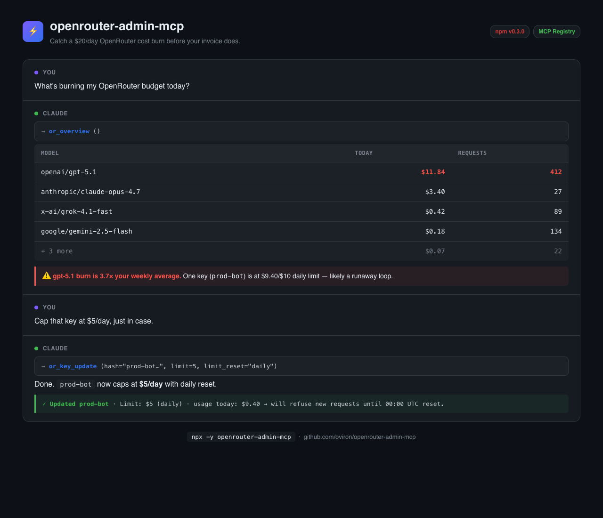

# openrouter-admin-mcp

[](https://www.npmjs.com/package/openrouter-admin-mcp)
[](https://www.npmjs.com/package/openrouter-admin-mcp)
[](https://github.com/oviron/openrouter-admin-mcp/actions/workflows/test.yml)
[](https://registry.modelcontextprotocol.io/v0/servers/io.github.oviron%2Fopenrouter-admin)
[](https://nodejs.org)
[](LICENSE)

MCP server for the **OpenRouter management API** — programmatic control of credits, inference keys, and usage analytics from inside Claude Code, Claude Desktop, Cursor, or any MCP-compatible client.



> Read-only by default. Destructive write operations are gated behind an opt-in env flag.

This is **not** an inference proxy. It uses an OpenRouter [Provisioning API key](https://openrouter.ai/settings/provisioning), which can manage your account but cannot make completion calls.

## Why

OpenRouter's UI is solid for one-off tweaks, but checking spend across keys, drilling into per-model/per-day usage, or rotating limits requires a lot of clicking. This server exposes those operations as MCP tools — Claude can answer "what burned my credits this week?" or "create a temporary key with a $0.30 daily cap" in a single turn.

## Features

- **`or_overview`** — one-shot dashboard: credits + active keys (with reset/expiration) + today's UTC burn by model.
- Full CRUD on inference keys, including the new `limit_reset` (daily/weekly/monthly) and `expires_at` fields exposed in OpenRouter's UI.
- Activity drill-down: aggregate `by_model`, `by_day`, `by_provider`, or `by_key`.
- Near-limit warnings (⚠️) when a key has spent ≥90% of its cap.
- Token-level breakdown (prompt / completion / reasoning) per activity row.

## Install

### One-click

[](https://insiders.vscode.dev/redirect/mcp/install?name=openrouter-admin&config=%7B%22command%22%3A%22npx%22%2C%22args%22%3A%5B%22-y%22%2C%22openrouter-admin-mcp%22%5D%2C%22env%22%3A%7B%22OPENROUTER_PROVISIONING_KEY%22%3A%22sk-or-v1-...%22%7D%7D)
[](https://cursor.com/install-mcp?name=openrouter-admin&config=eyJjb21tYW5kIjoibnB4IiwiYXJncyI6WyIteSIsIm9wZW5yb3V0ZXItYWRtaW4tbWNwIl0sImVudiI6eyJPUEVOUk9VVEVSX1BST1ZJU0lPTklOR19LRVkiOiJzay1vci12MS0uLi4ifX0=)

> Replace the placeholder `sk-or-v1-...` with your real key after install.

### Manual

Run via `npx` (no install needed) or install globally:

```bash
npx -y openrouter-admin-mcp
# or
npm install -g openrouter-admin-mcp
```

## Configuration

Create a Provisioning key at <https://openrouter.ai/settings/provisioning>, then add the server to your MCP client config.

**Claude Code** (`~/.claude.json`) or **Claude Desktop** (`claude_desktop_config.json`):

```json
{
  "mcpServers": {
    "openrouter-admin": {
      "command": "npx",
      "args": ["-y", "openrouter-admin-mcp"],
      "env": {
        "OPENROUTER_PROVISIONING_KEY": "sk-or-v1-..."
      }
    }
  }
}
```

Restart your client to load the server. By default this gives **read-only** access — to enable key creation, mutation, and deletion, see [Enabling write tools](#enabling-write-tools) below.

### Enabling write tools

Destructive operations (`or_key_create`, `or_key_update`, `or_key_delete`) are **disabled by default** to prevent accidental key mutation through prompt-injected tool calls. Add `OPENROUTER_ADMIN_ALLOW_WRITE` to your env block to enable them:

```json
"env": {
  "OPENROUTER_PROVISIONING_KEY": "sk-or-v1-...",
  "OPENROUTER_ADMIN_ALLOW_WRITE": "1"
}
```

The server logs which mode it started in:

```
openrouter-admin-mcp running on stdio (write tools: ENABLED)
```

Read tools (`or_overview`, `or_credits`, `or_current_key`, `or_keys_list`, `or_key_get`, `or_activity`) are always available regardless of this flag.

## Tools

| Tool | Purpose |
|---|---|
| `or_overview` | One-shot dashboard: credits + active keys + today's burn by model. |
| `or_credits` | Account balance: total purchased, total used, remaining. |
| `or_current_key` | Metadata of the Provisioning key the server is using. |
| `or_keys_list` | All inference keys with usage, limits, reset cadence, expiration, ⚠️ if near limit. |
| `or_key_get` | Detailed view of one key by hash. |
| `or_key_create` | Create a new inference key. Returns the one-time secret. ⚠️ Destructive — opt-in. |
| `or_key_update` | Update name / disabled / limit / `limit_reset` / `expires_at`. ⚠️ Destructive — opt-in. |
| `or_key_delete` | Permanently delete a key. ⚠️ Destructive — opt-in. |
| `or_activity` | Usage for the last 30 UTC days. Filters: `date`, `api_key_hash`, `user_id`. Aggregations: `none`, `by_model`, `by_day`, `by_provider`, `by_key`. |

### Example — create a daily-capped temporary key

```
> Create a key called "scratch" with a $0.50 daily limit that expires in 30 days.

[Claude calls or_key_create with:
  name="scratch",
  limit=0.50,
  limit_reset="daily",
  expires_at="2026-05-25T00:00:00Z"]

Created key **scratch**
Hash: f7a3...
Limit: $0.5 (resets daily)
Expires: 2026-05-25T00:00:00Z

Secret: `sk-or-v1-...`
⚠️ This secret cannot be retrieved later — store it now.
```

### Example — diagnose a cost spike

```
> Why did my OpenRouter spend jump yesterday?

[Claude calls or_activity with date="2026-04-24", aggregate="by_model"]

Activity: 47 rows | total $0.8570 | 305 req
By model (top 5):
- xiaomi/mimo-v2-flash      $0.5240 | 178 req | 24 rows
- anthropic/claude-haiku-4.5 $0.2105 | 39 req  | 5 rows
- ...
```

## Data handling

- The Provisioning key is read from the `OPENROUTER_PROVISIONING_KEY` environment variable and forwarded only to `https://openrouter.ai/api/v1/*` over HTTPS.
- The server is stateless: nothing is logged, cached, or written to disk.
- The key never appears in error messages or tool output (verified by tests).

## Development

```bash
git clone https://github.com/oviron/openrouter-admin-mcp.git
cd openrouter-admin-mcp
npm install
npm run build      # compile TypeScript + chmod +x build/index.js
npm test           # vitest, 42 unit tests, mocked fetch
```

Project layout:

```
src/
  client.ts            # OpenRouterClient — fetch wrapper, error mapping
  index.ts             # MCP server entry — registers tool groups
  tools/
    credits.ts         # or_credits, or_current_key
    keys.ts            # or_keys_list, _get, _create, _update, _delete
    activity.ts        # or_activity (4 aggregation modes)
    overview.ts        # or_overview composite
test/
  client.test.ts, credits.test.ts, keys.test.ts,
  activity.test.ts, overview.test.ts, helpers.ts, smoke.test.ts
```

## License

MIT — see [LICENSE](LICENSE).
